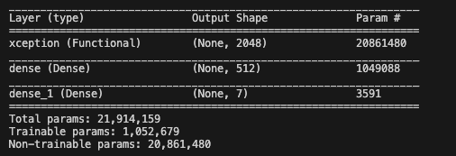
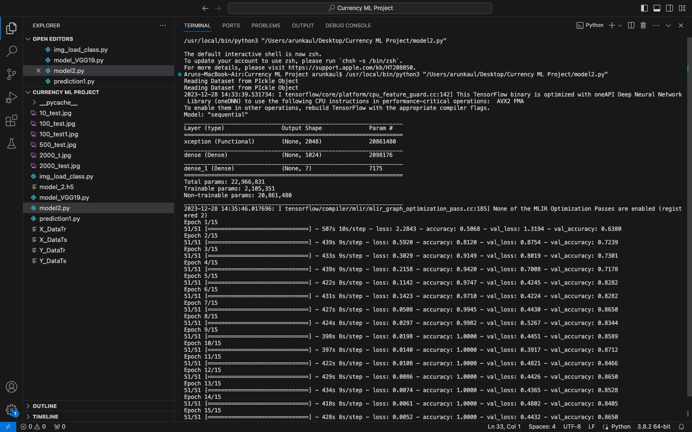

# Transfer Learning Tensorflow Indian Currency Classifier

## Introduction 

#### The Indian Currency Classifier is like a smart project that teaches machines to tell apart different Indian currencies. It's super useful in places like stores, banks, vending machines, and ATMs. Imagine machines becoming really good at recognizing money - that's what this project is all about! It's like giving our machines a cool new skill that can make things smoother in everyday life.

## Working

#### In my project, I applied transfer learning to boost the accuracy of predictions on my dataset. Specifically, I chose the Xception Deep Learning Algorithm because it showed the highest accuracy. My dataset includes images of 10,20,50,100,200,500,2000 Rupees Images.To tailor it for my dataset, I added my own neural network layers. By tweaking various hyperparameters, I fine-tuned the model to achieve the best training and testing errors. This way, I made sure the algorithm worked efficiently for my specific needs

## Architecture 

## Accuracy

## Output

## Specifications
#### Input Image Size : 299x299

## How To Use
- Download prediction1.py and model2.h5
- import class Indian_Currency_To_Text to your code and use it as shown in the predicition1.py file.

